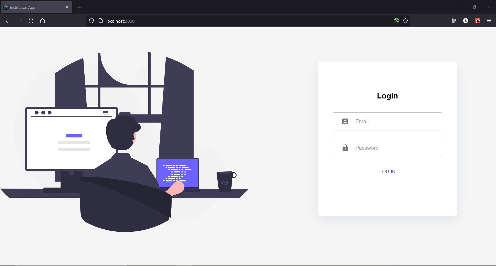
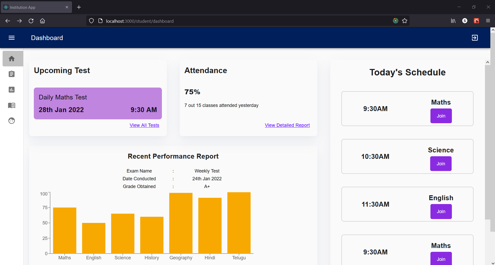
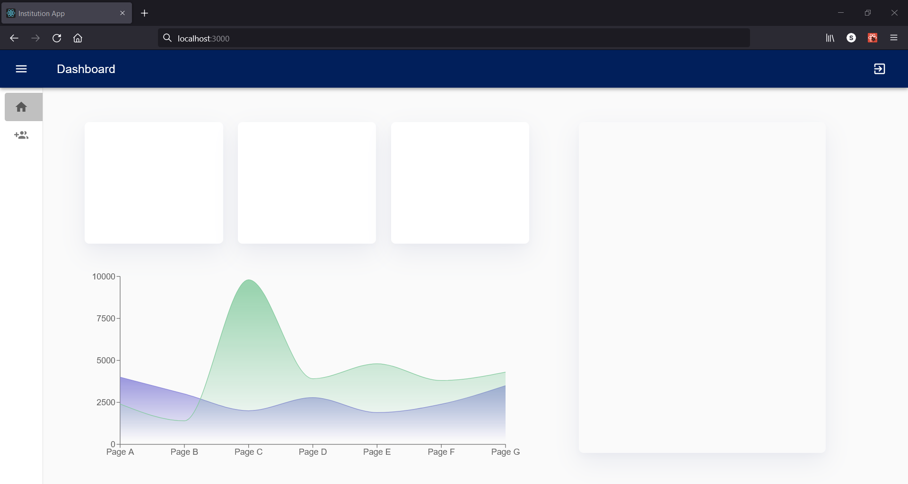

# institution_app

## Backend API

### Progress

- `Super Admin`
  - [x] `POST /api/v1/superAdminLogin`
- `Admin`
  - [x] `POST /api/v1/admin/login`
- `Swagger Docs`
  - [x] `/docs`

## Frontend

### Screen Shots

#### Login Screen

#### Student Dashboard

#### Super Admin DashBoard

### Progress

- `Super Admin`
  - [x] `login screen`
  - [x] `DashBoard`
  - [x] `Manage Admins Form`
- `Admin`
  - [x] `Admin login Screen`
- `Student`
  - [x] `Dashboard`
